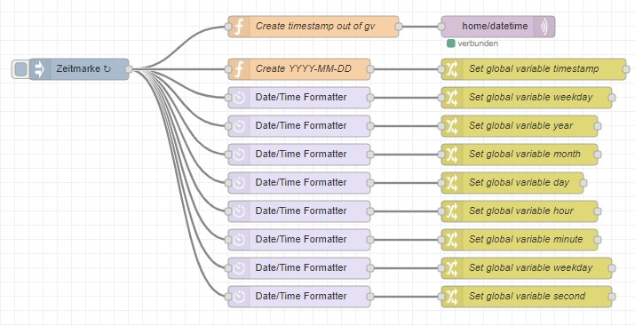

# nodered-datetime

Creation of global date and time variables to be used for Node-RED Flows

You can find the complete flow ***flows.json*** for import to Node-RED in this GitHub-repository.

## FEATURES

- Set global variables for
    - weekday
    - year
    - day
    - hour
    - minute
    - weekday
    - second
- Combining these variable in
    - timestamp format (e.g. for log files) like ***YYYY-MM-DD HH:MM***
    - timestamp format (e.g. for dashboard) like ***Thursday, 30.04.2020***

## LICENSE

nodered-datetime and all individual scripts are under the BSD 3-Clause license unless explicitly noted otherwise. Please refer to the LICENSE
